# 市盈率、市净率、市销率

## 市盈率（PE）:公司市价与盈余利润比

**市盈率（PE） = 股价/每股收益 = 股票总市值/公司净利润**

其实很好理解，**因为PE正好等于回收成本的时间。**

假设，你心血来潮投资楼下的面馆。你和老板、老板娘三人一共出资9万，即，面馆市值9万。过去一年，面馆净赚2万。那么，面馆的市盈率为PE=9/2=4.5. 不难算出，只要面馆稳定盈利4年半，你和老板、老板娘全都能回本。

**在公司每年都能稳定盈利的条件下，市盈率越低，散户投资回本的速度越快。**

为了适应不同公司财报中，不同的利润结算方法，以及市场各种情况下的估值要求。逐渐演变出以下三种常用的市盈率计算公式。优缺点、适用情况也已经注明。

**最常用的是滚动市盈率（PE-TTM），每季度更新一次，时效性最强。**

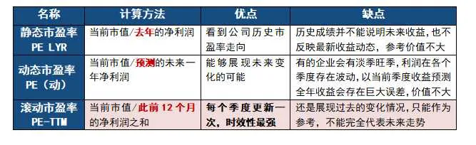

## 市净率（PB）：公司市价与净资产比

**市净率（PB）=股价/每股净资产=股票总市值/公司净资产**

公司净资产，简单来说就是公司的总资产减去负债之后的钱。

净资产一般由两大部分组成，一部分是公司开办当初投入的资本，包括目前市场的溢价部分，比如20年前开工厂100万买了一块地皮，现在值500万了；另一部分是公司在经营之中创造的，如生产的产品等等，净资产也包括接受捐赠的资产。

每股净资产，是指股东权益与总股数的比率，其计算公式为：**每股净资产= 股东权益/总股数**。

这一指标反映每股股票所拥有的资产现值。

**每股净资产越高，股东拥有的资产现值越多；每股净资产越少，股东拥有的资产现值越少。**

**市净率越大，表示市值与净资产的比率越大，市净率越小，则比率越小。**

**低市净率意味着投资风险小，万一上市公司倒闭，清偿的时候可以收回更多成本。**

## **市销率（PS）：公司市价与主营业务收入比**

**市销率（PS）=股价/每股销售收入=股票总市值/公司主营业务收入**

市销率的基本概念，是指投资如果获得公司1元的销售收入需要投入多少钱，

在不考虑其他因素影响的条件下，一般来说市销率越小的公司越值得我们投资，因为这意味着我们赚钱的成本更低，

但实际应用并没有这么简单，往往需要考虑多方面的影响。

**过去在国内的二级股票市场，市销率并不怎么常用**，

因为A股对于上市公司的盈利本身就有要求，

但随着越来越多的公司在科创板上市，注册制也逐渐推进，**未来投资对于市销率将会越来越重视**。

<u>市盈率、市净率、市销率这三个指标，**目前主要使用的是市盈率**，对于市净率和市销率，则是起着辅助作用。</u>

### 如何利用市盈率赚钱

理论框架、实战工具已经准备妥当，接下来才是真正硬核的实战环节。

#### 1、利用市盈率的波动规律赚钱

市盈率会受短期市场情绪变化影响，出现剧烈波动。个股的市盈率变化最为明显。

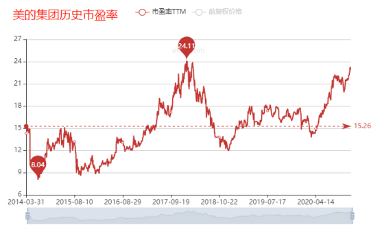

美的集团上市6年，经历了两次严重高估，以及两次明显的低估。

我们可以从这些年的波动中，发现“**物极必反，周而复始**”的规律。

市场情绪总是短暂的，没有什么股票会永远高估，也不会被一直低估。

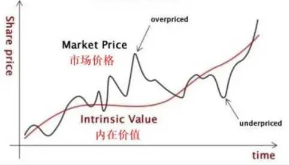

这一现象被叫做：**均值回归。**

不论是股票、指数、基金都呈现出**“价格围绕价值，上下波动”**的趋势。

认识“价值规律”的存在，是实操的第一步。

#### 2、利用规律赚钱的最好方法，其实就是低买高卖！

既然市盈率在波动，我们就把握这个波动。

以下是A股平均市盈率变化图，可以在乐咕乐股网查询。

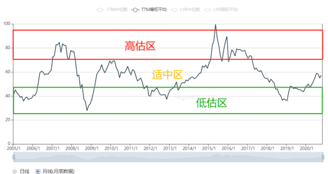

根据市场历史估值变化简单画出了高低估区，重申一下：

**买得便宜，卖得贵，是我们利用规律赚钱的核心思路。**

落到实操层面必须解决的问题是：

什么时候是最低？什么时候是最高？什么时候合适买？什么时候应该卖？

**这需要引入市盈率百分位概念，也被简写为PE百分位。**

当市盈率百分位为20%时，说明现在的价格比过去80%的时间都便宜。

当市盈率百分位为70%时，说明现在的价格只比过去30%的时间便宜。

逻辑和我们日常购物是一样的，碰上的折扣力度越大，我们买的商品越值。

**一般来说，当全A股市盈率百分位30%以下比较便宜，类似折扣价。**

**70%以上则泡沫明显，类似黑心商家抬价。**

**其余时间在估值适中区震荡，类似日常价格。**

理论上，投资想要赚大钱，我们应该把家里所有的钱都拿出来，再加2倍杠杆一把梭，在最低点买入。等到市场普遍哄抬价格、陷入疯狂的时候，高价卖出。

但我们无法知道，全市场的“商家”未来什么时候开始打折，市场又在什么时候会陷入疯狂。

**投资市场不是双十一，不会在打折之前满世界打广告，这需要自己把握。**

既然大涨大跌这么难预测，只能制定一套买入策略，确保不管未来怎么变，我们都能以相对低价买入。

经过多次实践优化，我有了以下策略：

**把资金分成100份左右。**

**当等权市盈率百分位在30-40%之间，买入0.5份。**

**当等权市盈率百分位在20-30%之间，买入1份。**

**当等权市盈率百分位在10-20%之间，买入3份。**

**当等权市盈率百分位低于10%，买入5份。**

等权市盈率百分位最新数值，可以在A股平均市盈率变化页面查到：

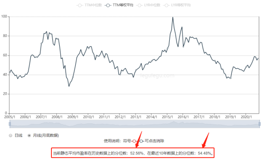

具体分析一下，

**理论上等权市盈率百分位30%以下买入最保险。**但随着近20年A股整体投资价值缓慢提升，绝对低点难找，更多是相对低点。所以，我们可以把入场标准稍微调高，当等权市盈率百分位跌至40%开始买入。**虽然不是最低的位置，但也相对便宜。**

如果等市场等权市盈率百分位跌至30%以下，加大买入力度。跌至20%以下，就是非常便宜的时候，平常很贵的茅台等白富美也会打6折，这时我们下重手一次买入3-5份，保证买到的便宜筹码足够多。这类机会往往千载难逢，稍纵即逝，需要成倍的耐心蹲守。

反之，一旦估值往上涨，超过40%，我就趴着不动。宁可内心煎熬，也绝不高位踏空。

#### 3、实操展示

##### （1）买入实操：

理论说多少遍都是模糊的。别听一个人是怎么说，要看他怎么做。

以下是我的永动机-进取组合加仓情况：

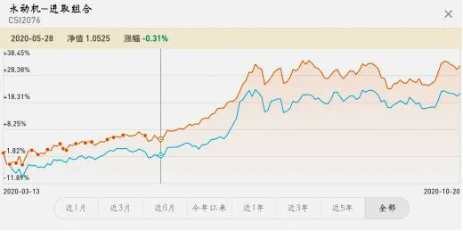

（每一个小点都是一次买入）

年初市场估值较低，大盘在2700-2800附近打滚，我安心地买了不少。

最后一次买入在5月底，**当时市场等权百分位徘徊在30%上下**，大盘点位不到2900。那时差不多是市场等权百分位最后一次跌破30%，之后一路上涨，一直涨到今天的50%上下。

**涨过30%的估值临界线，不论怎么震荡、上涨我也没出手，因为实在是贵了，买了不值。**

组合运作了大半年，累计收益33%以上，比沪深300收益高10%+。轻松跑赢大盘。

现在回头去看，年初2700点简直像做梦一样便宜，结合今天的大盘，简直恍如隔世。下一个低于30%的节点不知道什么时候到来，最好边等边看。

##### （2）卖出实操：

买得便宜固然重要，但我们投资不是为了加仓而加仓，

**落袋为安才是硬道理。**

目前等权市盈率百分位还没到70%，理论上，距离止盈还有一段差距，暂且按兵不动。

大盘没到止盈时间，但细分行业指数早已飞升，完全符合止盈标准。

下面是我今年利用**行业市盈率百分位**成功止盈的实操案例：

① 先说说我从**创业板**上赚了多少钱。

创业板第一次止盈：

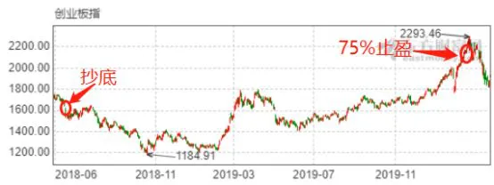

创业板第二次止盈：

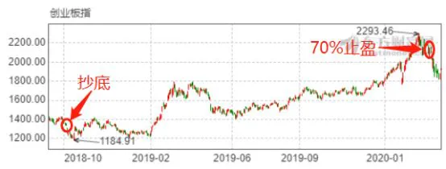

**两次卖出合计盈利72.27%。**

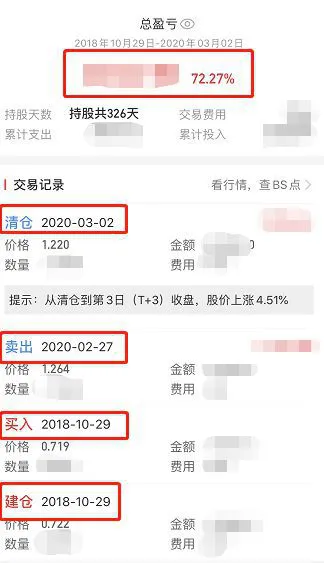

2018年10月买入时，创业板指估值历史最低。**当月创业板市盈率百分位甚至跌破1%……**

买！直接建仓抄底，躺着等待最高点的来临。

之后一年半时间里，涨了96%。**我没动，上涨不是止盈的标准，市盈率百分位才是！**

今年2月底、3月初，创业板的市盈率百分位时隔近4年，终于重登70%。

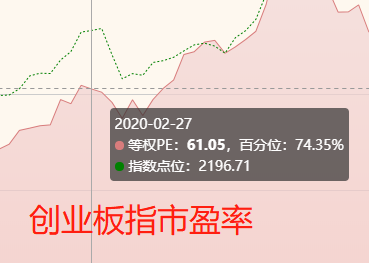

再重申一下市盈率百分位的应用策略：**30%以下进入加仓区间，70%以上进入止盈区间。**

创业板市盈率百分位70%以上，已经达到止盈标准。

再加上年初国内疫情冲击，股市人心惶惶，一不小心又砸下一个坑。

我选择止盈，安安稳稳地拿着72.27%的收益下车。

没有什么特别的技术操作，在最低点买入，在止盈点卖出，轻轻松松拿70%+收益。

② 再说说**医药行业基金**的止盈。

医药行业投资的基本逻辑：**低位买入后可以长期持有，不用轻易止盈。**

医药本来就是长牛行业，自身业绩稳定，今年又有全球疫情加持，必然持续走高，就看具体能冲多高。

今年6月初，全指医药指数市盈率百分位突破70%，很快又突破85%。（全指医药指数：追踪A股所有医药类上市公司股价的指数）

我决定第一次止盈，收益76.04%，比创业板好点，还行。

一个月后，全指医药市盈率百分位涨至90%以上。

我进行了二次止盈

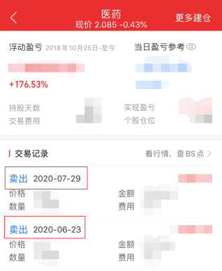

所有医药公司平均市盈率百分位达90%以上，说明整个行业都有些飘飘然，必须提前开溜。

果不其然，第二次止盈后不久，很快转入高位震荡。医药行业市盈率百分位至今也没回到当时的高点……

##### （3）止盈小结：

①波动大的投资对象要“见好就收”，不必长持，**市盈率百分位70%左右是一个止盈节点。**

②医药、消费等长牛行业则可以慢慢等慢慢卖，毕竟它们的业绩总在增长。哪怕估值不涨，还可以赚企业利润增长的钱。**市盈率百分位超过70%后，85%、90%、95%都是关键止盈节点。**

到这里，利用均值回归赚钱的策略、实操都已经介绍清楚。

**重要的事情再强调一遍！**

**一切操作、策略的终极目标都是：争取全部买在最低点，全部卖在最高点！**

**我们只需要低点加仓买入，涨了趴着不动，根据市盈率百分位止盈，就能轻轻松松赚钱！**

如果错过了2018年熊市1%的市盈率百分位，哪怕晚一步在2019年，或是今年年初买入，都无法享受**70%+**的收益，只能喝点30%、20%收益的汤。

现在点位过高，早已错过机会，还是静待下一次估值暴跌到来吧……

### 市盈率的局限性

原本文章在上面就已经结束，大家拿着方法去赚钱就行了。

但就像世界上从来没有包治百病的万能神药。

市盈率虽好，但在某些具体情况下也不太好用。虽然特殊情况只占30%，但就怕新手朋友们一不小心踩坑啊……

**以下是多多的良心附赠内容~**

#### （1）市盈率只反映过去和当下的市场

不论从什么角度来看，市盈率都是“静止的数据”：每天的市盈率值都是当天估值的结算。

企业明天估值如何变化？未来估值如何变化？

其中增长或者下降的趋势无法判断。

**可投资关键是看未来发展啊！**

为了弱化这个缺点，衍生出PEG估值法。

PEG = 市盈率 / 净利润增长率

【净利润增长率】的加入，一定程度上弥补了市盈率。毕竟，投资就是买企业未来的赚钱能力，挣钱速度当然是越稳定、越快越好。

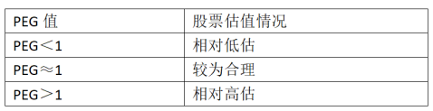

当PEG=1，企业利润增速与市盈率一致，股价和市值没有被炒作，估值是合理的；

当PEG＞1，市盈率高于利润增速，公司经营增速跟不上股价炒作速度，属于被高估；

当PEG＜1，市盈率低于利润增速，企业正在快速发展，但市场却没有注意到（股价没有水涨船高），被低估了，此时是买入的好时机。

#### （2）金融相关行业不适合用，例如银行、保险、证券业

虽然金融行业，尤其是各大银行，每年利润收入高且稳定。

但一次金融危机就能让前面赚的钱都亏回去。所以大家戏称，银行赚的是“假钱”。

此外，银行常常受中央政策调控，利润不会大涨。遇上经济紧缩，甚至还得积极让利。

最关键的是，银行关系国家经济命脉，以稳为主，不会变成吹上天的风口，所以

#### （3）周期行业不适用，例如钢铁、有色金属、化工等

在国内经济红火时，公司利润会跟着大涨，市盈率也会被推高；

国内经济低迷时，公司出现亏损，市盈率为负数。公司不创造利润，投资者当然分不到钱。

这类企业长期处于“几年饱、几年饥”的情况，收益极其不确定，不建议散户投资。

同理可得：**在大牛市和熊市，受市场整体带动效应影响，市盈率的参考作用也会大大削弱。**

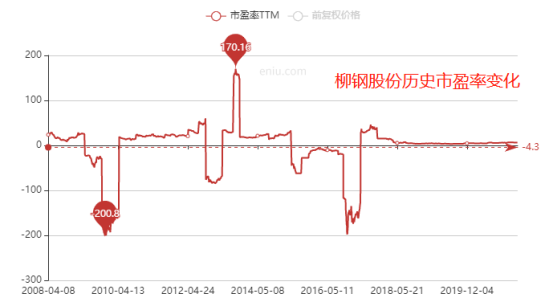

#### （4）战略性亏损的企业，例如京东、亚马逊、特斯拉等

市盈率估值以企业正常盈利为前提。

当企业正处于亏损时，市盈率是负数，也就不值得作为参考。

京东、亚马逊、特斯拉都是典型代表。很长时间都是把赚来的钱全投出去，不断扩大规模。市盈率是负数，但股价连续涨了很多年。

### 如何使用市销率？

#### 1、哪些地方适合市销率

市销率最适合的是那些处于起步阶段或成长阶段的公司，或者是“轻资产”具有高成长性的公司。

最典型的就是美团和拼多多，

这种类型的公司，都是刚上市的时候处于“烧钱”状态，赚的钱还没有花的钱多，在这种情况下，市盈率就会失效；

同时，因为这种互联网公司，本身并没有多少资产，公司最值钱的地方可能就是办公楼，说不定还是租的，所以市净率对其也是失效的。

这时候，就需要市销率上场，帮我们判断这种类型的公司是否值得投资了。



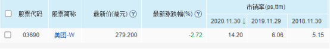

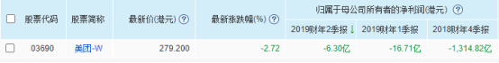

我们以港股上市的美团-W举例，

2018年美团刚上市时的PS是5.15，2019年为6.06，到了2020年则达到了14.2；

与此同时，从2018年开始，美团就在连年亏损，

2018年的净利润达到了-1314亿，

不仅没赚钱，还砸进去一千多亿，

这种情况下，我们只能通过市销率对它进行估值。

#### 2、市销率的优点

第一，市销率不会出现负值，

对于不断亏损或者资不抵债的企业，市销率也能获得一个相对有价值意义的数据；

第二，市销率相对来说比较稳定可靠，不容易备操纵，

因为市销率统计的是销售收入水平，是公司直接面对市场的反馈，所以相对来说更加真实准确一些。

#### 3、市销率的缺点

第一，局限性较大，

市销率实用的情况比较狭窄，不像市盈率那样，几乎适用于所有的企业和市场情况；

另一方面，市销率只能用于同行业对比，不同行业间的市销率对比没有太大意义。

第二，需要多方面的综合判断，

市销率仅仅只能体现销售收入的情况，对于公司的成本、现金流等等重要情况都不能反映，

所以使用市销率，还要结合公司的具体运营情况进一步分析，

每年有很多类似美团、拼多多的上市公司，都死在了黎明的前夜，

虽然依靠市销率，我们可以在低估值时买入它们，

但对于风险的把控还是要时刻注意。

## 来源：[一文带你搞懂市盈率、市净率、市销率 - 知乎 (zhihu.com)](https://zhuanlan.zhihu.com/p/345397436)